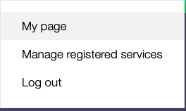
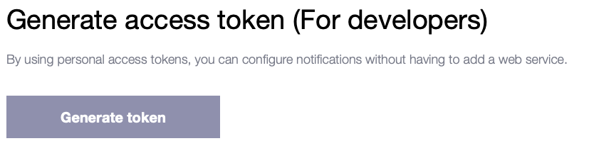
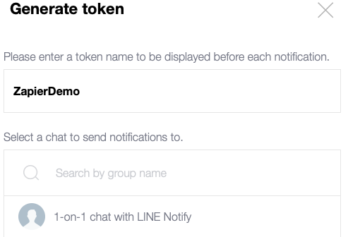
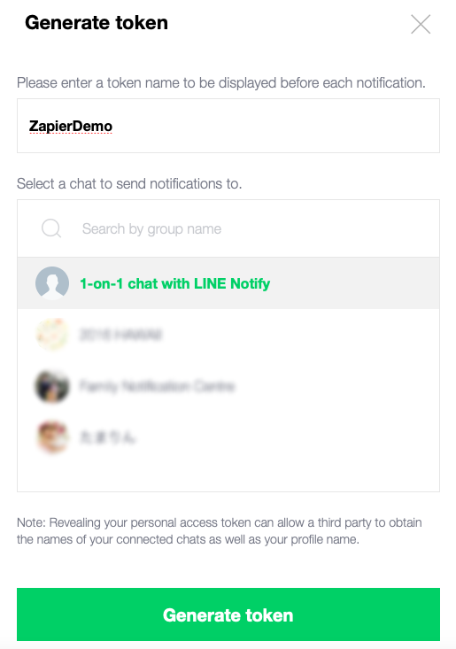
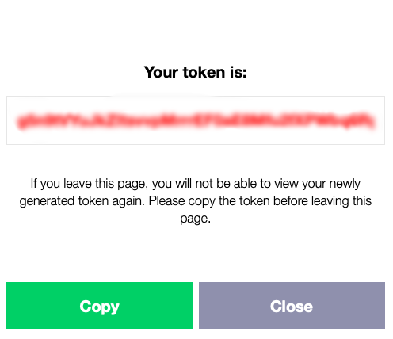

Setting up LINE.
================

Outline.
--------

Will will be doing the following steps:

1. Log into LINE Notify Bot
2. Create a group or user Token (Ensure that you copy this as you will see it \
   only once)

The Steps:
----------

Step 1:
^^^^^^^
Log into the site `here <https://notify-bot.line.me/en/>`_. This supports \
English, Japanese and a few other languages.

Step 2:
^^^^^^^
Click on the 'My page'

Step 3:
^^^^^^^
Click on 'Generate token'

Step 4:
^^^^^^^
Provide a name for the token. In this case I have provided 'ZapierLine'

Step 5:
Choose if you want to send notications only to yourself using '1-on-1 chat with LINE Notify' \
or choose an existing chat group you have created within the LINE App on your device.
In this case I have chosen '1-on-1'

Click on 'Generate token'

Step 6:
^^^^^^^

Copy the generate token as you will only see this one.

