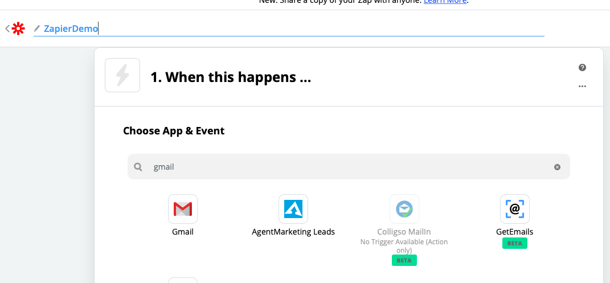
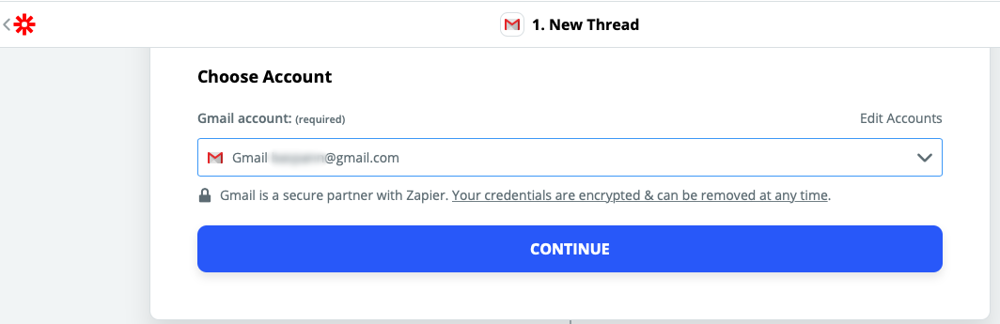

Setting Up Zapier.
==================

Outline
-------

This will take you through creating a Zap for sending notifications to your selected \
chat user or group.
I will not provide instructions on creating a `Zapier <https://zapier.com>`_ account.
I believe this is fairly simple and straight forward. Linking your google account to Zapier.

The Steps:
----------

Step 1:
^^^^^^^

Either Click 'MAKE A ZAP' or 'Create Zap'

.. image:: images/Zapier/1-Zapier-CreateZap.png

Step 2:
^^^^^^^
Give your Zap a name. I have used 'ZapierDemo'
If you don't see Gmail in the app list, enter it in the search as I have done.
Click on 'Gmail'

Step 3:
^^^^^^^

Choose your 'Trigger Event'
For you you should choose 'New Thread'

Step 4:
^^^^^^^

Click 'Continue'

Step 5:
^^^^^^^

Select your connected Gmail account. This will tell Zapier which gmail account to monitor.

Click 'Continue'

step 6:
^^^^^^^

Select the correct Gmail Label. In this case we are using 'ZapierLine'

Click 'Continue'

Step 7:
^^^^^^^

Next we need to 'Test your Trigger'. So click this button.

This will now look for any messages that contain the label we have provided. 'ZapierLine'

If you are happy with the result. Click 'Continue'

Step 8:
^^^^^^^

Enter 'Code by Zapier' and click on 'Code by Zapier'

Step 9:
^^^^^^^

For 'Choose Action Event' select 'Run Python'

Click 'Continue'

Step 10:
^^^^^^^^

At this point we will start selecting what information we want to extract from the email.
This is of course optional. If you wish you could simply have a notification sent to your line \
account letting you know to check your email.
However in this case we will collect some data to add to the notification.

I will extract the following details. from, subject and body. These names are provided by me.
I will then select from the drop down the actual items I am looking for.

.. image:: images/Zapier/12-Zapier-Extraction-Complete.png

Next we need to enter our code in the code window.

Sample 1:
This code simply takes the plain text body of the email and sends it in the notification.

.. code-block:: python
   :linenos:

   import requests
   API_URI = "https://notify-api.line.me/api/notify"

   text_message = input.get('body')
   TOKEN = "YOUR_GENERATED_TOKEN_GOES_HERE"
   HEADER = {"Authorization": "Bearer " + TOKEN}
   PARAMS = {"message": text_message}

   response = requests.post(API_URI, headers=HEADER, params=PARAMS)
   response.raise_for_status()
   return {'rawHtml': response.text}

Sample 2:
This code sends a different text message depending on the from address of the sender.

.. code-block:: Python
   :linenos:

   import requests
   API_URI = "https://notify-api.line.me/api/notify"

   if input.get('from') == 'AddressA':
      text_message = "This is the message for sender A"
   if input.get('from') == 'AddressB':
      text_message = "This is the message for sender B with email body included:\n\n{}".format(input.get('body'))

   TOKEN = "YOUR_TOKEN_GOES_HERE"
   HEADER = {"Authorization": "Bearer " + TOKEN}
   PARAMS = {"message": text_message}

   response = requests.post(API_URI, headers=HEADER, params=PARAMS)
   response.raise_for_status()
   return {'rawHtml': response.text}

NOTE: If you get an error message that execution took more than 1 second. This can be ignored.
Simply Click the 'Skip Test' in the upper right corner.

Step 11:
^^^^^^^^

Active your ZAP

